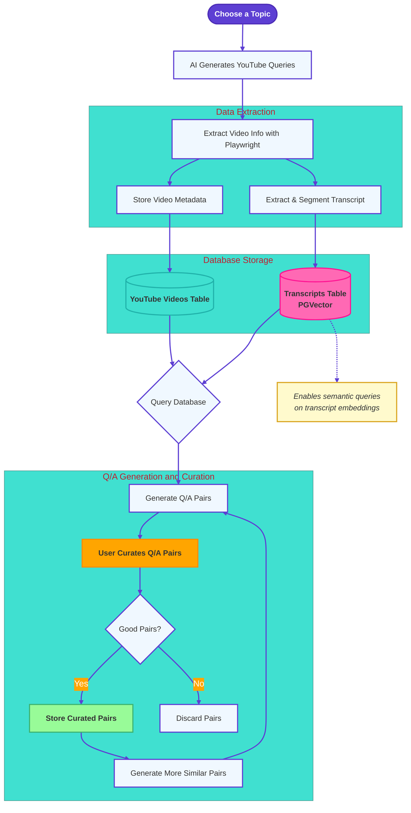

# CHAT WITH DATABASE?

## The goal of this project is to automate datacuration

```mermaid
%%{init: {
  'theme': 'base',
  'themeVariables': {
    'primaryColor': '#5D3FD3',
    'primaryTextColor': '#FFFFFF',
    'primaryBorderColor': '#4D2DB7',
    'lineColor': '#5D3FD3',
    'secondaryColor': '#FFA500',
    'tertiaryColor': '#40E0D0'
  }
}}%%

graph TD
    %% Nodes
    A([Choose a Topic]):::start
    B[AI Generates YouTube Queries]
    C[Extract Video Info with Playwright]
    D[Store Video Metadata]
    E[Extract & Segment Transcript]
    F[(YouTube Videos Table)]:::db
    G[(Transcripts Table<br>PGVector)]:::pgvector
    H{Query Database}
    I[Generate Q/A Pairs]
    J[User Curates Q/A Pairs]:::user
    K{Good Pairs?}
    L[Store Curated Pairs]:::storage
    M[Discard Pairs]
    N[Generate More Similar Pairs]

    %% Connections
    A --> B
    B --> C
    C --> D & E
    D --> F
    E --> G
    F & G --> H
    H --> I
    I --> J
    J --> K
    K -->|Yes| L
    K -->|No| M
    L --> N
    N --> I

    %% Subgraphs
    subgraph "Data Extraction"
        C
        D
        E
    end

    subgraph "Database Storage"
        F
        G
    end

    subgraph "Q/A Generation and Curation"
        I
        J
        K
        L
        M
        N
    end

    %% PGVector Note
    O[Enables semantic queries<br>on transcript embeddings]:::note
    G -.-> O

    %% Styles
    classDef default fill:#F0F8FF,stroke:#5D3FD3,stroke-width:2px,color:#333,font-family:Arial,font-size:14px;
    classDef start fill:#5D3FD3,stroke:#4D2DB7,color:#FFF,font-weight:bold;
    classDef db fill:#40E0D0,stroke:#20B2AA,color:#333,font-weight:bold;
    classDef pgvector fill:#FF69B4,stroke:#FF1493,color:#333,font-weight:bold;
    classDef user fill:#FFA500,stroke:#FF8C00,color:#333,font-weight:bold;
    classDef storage fill:#98FB98,stroke:#3CB371,color:#333,font-weight:bold;
    classDef note fill:#FFFACD,stroke:#DAA520,color:#333,font-style:italic;

    %% Link styles
    linkStyle default stroke:#5D3FD3,stroke-width:2px;
```